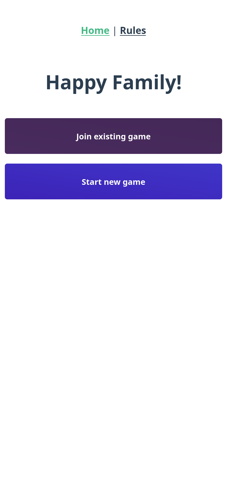
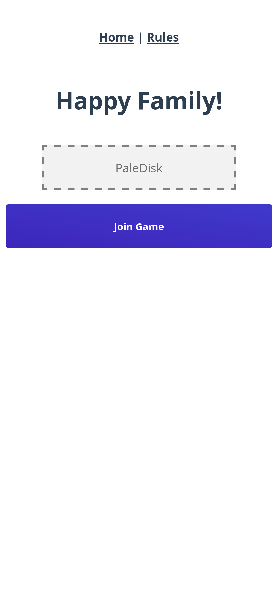
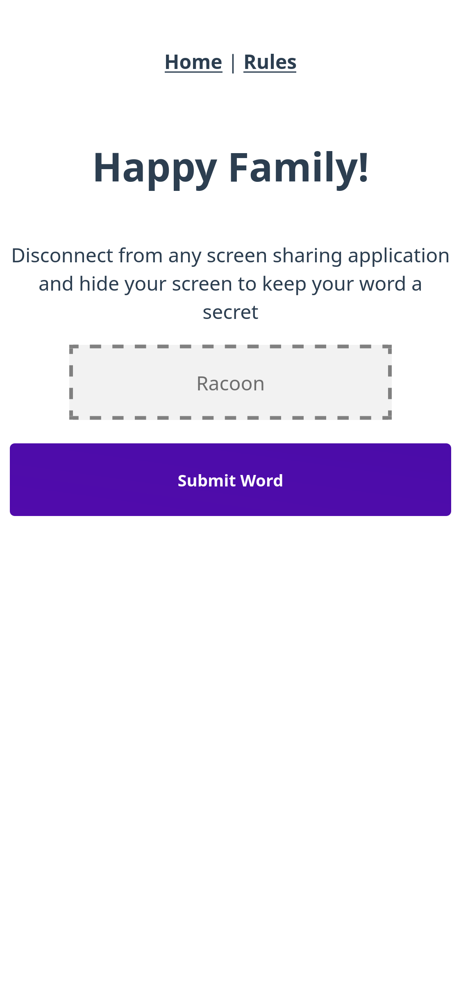
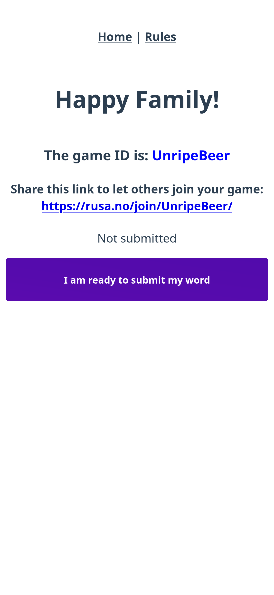
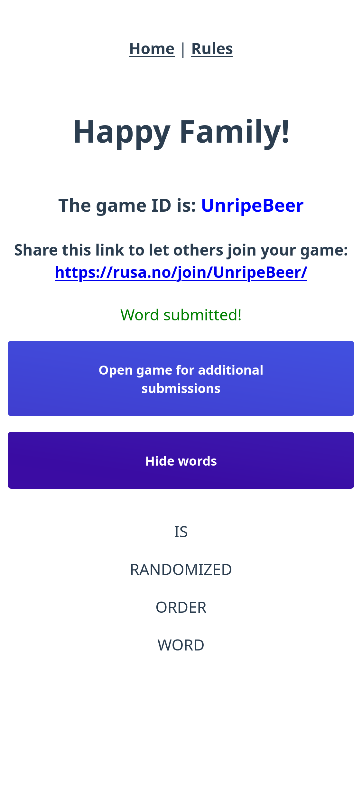

# HappyFamily-vue

Frontend for the game Happy Family written in Vue3 with Vuex and TypeScript

## What is Happy Family?

Happy Family is a social game where every participant writes down a word or a phrase. The gist of the game is to guess who wrote down which word and expand your family.

## Screenshots

